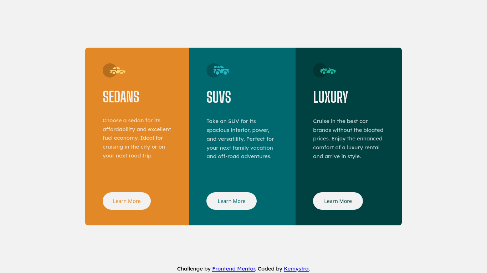

# Frontend Mentor - 3-column preview card component solution

This is a solution to the [3-column preview card component challenge on Frontend Mentor](https://www.frontendmentor.io/challenges/3column-preview-card-component-pH92eAR2-). Frontend Mentor challenges help you improve your coding skills by building realistic projects. 

## Table of contents

- [Overview](#overview)
  - [The challenge](#the-challenge)
  - [Screenshot](#screenshot)
  - [Links](#links)
- [My process](#my-process)
  - [Built with](#built-with)
  - [What I learned](#what-i-learned)
  - [Continued development](#continued-development)
- [Author](#author)

## Overview

### The challenge

Users should be able to:

- View the optimal layout depending on their device's screen size
- See hover states for interactive elements

### Screenshot



### Links

- Solution URL: [Github](https://github.com/Kemystra/frontendmentor-column-preview)
- Live Site URL: [Live](https://taupe-wisp-5fa908.netlify.app/)

## My process

### Built with

- Semantic HTML5 markup
- SASS loops
- Flexbox

### What I learned

You can use a large value for `border-radius` to make a rounded ends containers (buttons, divs, etc).
```css
/* Just don't use percentage for its unit */
border-radius: 999px;
```

This is also my first time using `clamp()` function in CSS!
```css
height: clamp(250px, 60%, 1000px);
```

### Continued development

A technique that I discovered is using viewport-relative units for containters, and use percentages for content inside it. This way the content would follow the container size, not the viewport.

## Author

- Frontend Mentor - [@Kemystra](https://www.frontendmentor.io/profile/Kemystra)
- Twitter - [@kemystra](https://www.twitter.com/kemystra)